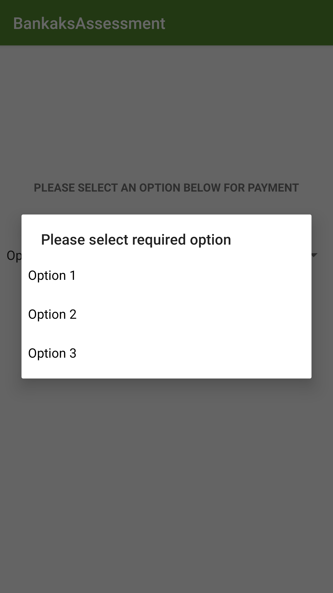

## Android-App-Using-Bankaks-Api
This project is an application for the coding assessment provided by Bankaks .

## Problem Statement:

A user on the Bankaks mobile platform wants to make a bill payment for a given
particular country. As there are multiple countries, the inputs for each
of them will always be different. The solution is provided by the Backend team with all the necessary inputs in an API endpoint and then render the screen
dynamically. 

The flow for dynamic screen rendering is as follows:

In the first screen, the user will pick a service from a dropdown list. For this
assessment, we will have dummy options: Option 1, Option 2 and Option 3. Once
the option is selected and user proceeds, the API endpoint will be hit with an input
parameter called type and its value will be 1, 2, or 3, one for each of the options
correspondingly. 

The API response will have the contents and details of the dynamic screen to be
rendered after proceeding. This screen will be a form with a title, some inputs and a
proceed button. The inputs fields will have their UI Element Type, the placeholders
and the validation rules. The user will only be able to proceed, if all the validations
specified in the API response are satisfactory. If not, the user should be prompted
with an understandable error message.

## Screenshots :

   

   
 
